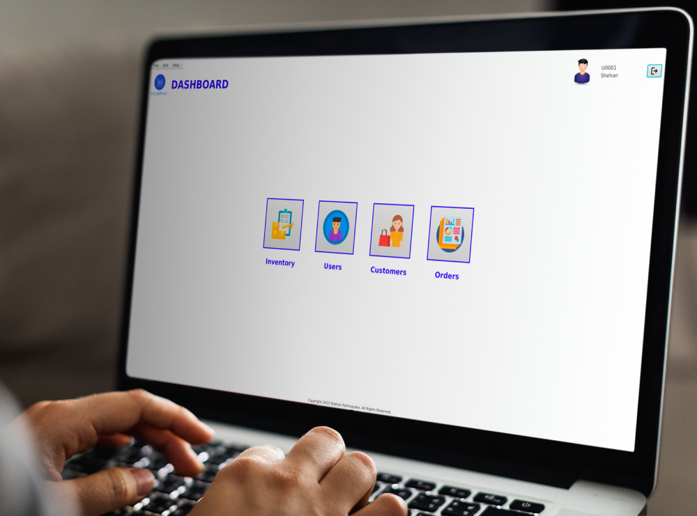
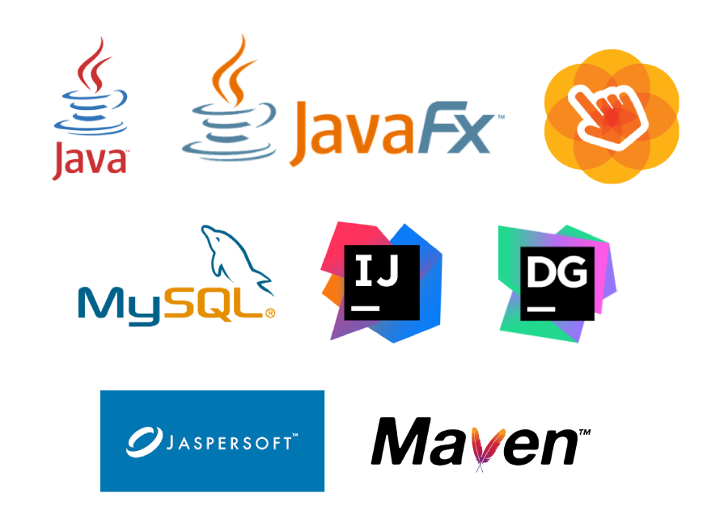
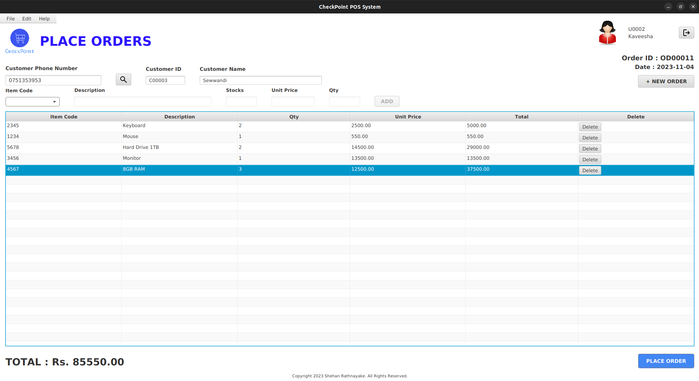
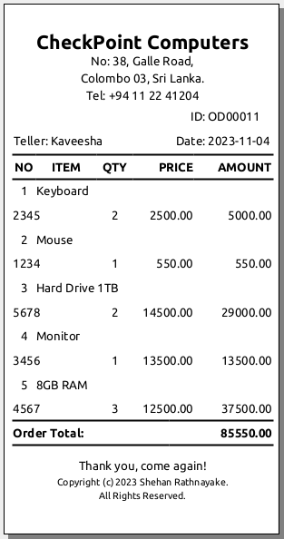
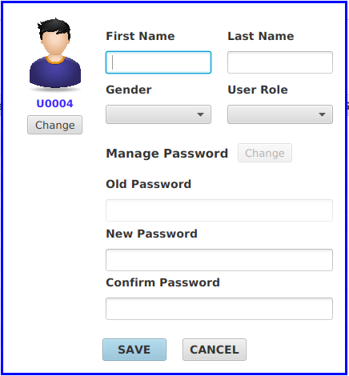
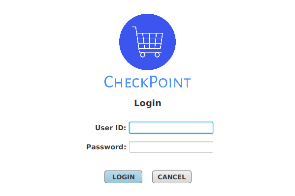

# CheckPoint POS System

### Version
0.1.0

### License
Copyright &copy; 2023 Shehan Rathnayake. All Rights Reserved. 
This product is licensed under [MIT License](License.txt).

### SRS Document

[SRS Document](SRS-Document.pdf)

## Introduction

In this project, I have designed a Java based POS system to streamline transactions for retail customers and effectively manage inventory. The name I have given to this project is Checkpoint POS System. The primary goal of this project was to create a solution that provides accuracy, efficiency, and ease of use for shop owners. [see more...]()

## Technologies Used

- Java
- JavaFX
- SceneBuilder
- MySQL
- JasperSoft Studio
- Maven
- intellij IDEA
- DataGrip

 

## Supported Links

- [Comprehensive Project Story on Medium](https://medium.com/@shehan_rathnayake/my-experience-in-point-of-sale-system-project-af15e4cada95) 👈

## Sample Images

 

 

 

 

 

 

### Support

***If you like what I do, maybe consider buying me a coffee*** 🥺 👇

  
